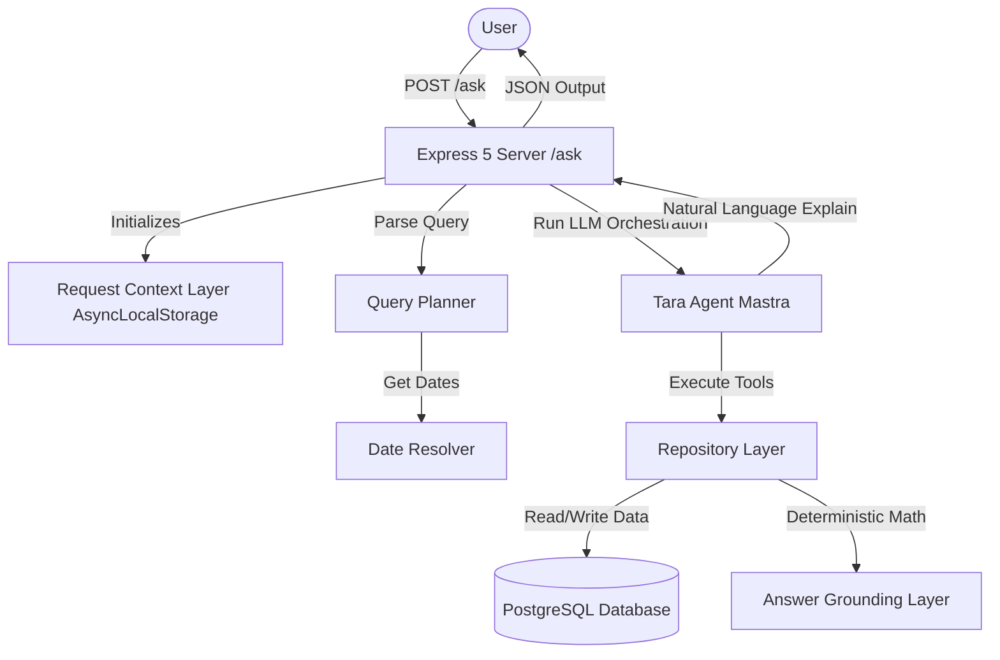
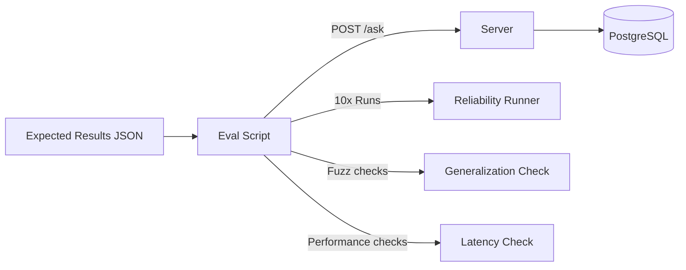

# Architecture Documentation

This document describes the design patterns, workflows, lifecycles, and component interactions of the Tara Finance Research Agent.

---

## 1. System Architecture Diagram

---

## 2. Request Lifecycle

The system processes a user's request through four clear stages:

### Stage A: Request Initiation & Context Initializer
1. An incoming JSON body reaches the `/ask` route.
2. The server initializes a unique `requestId` and `traceId`.
3. The context is mounted in Node's `AsyncLocalStorage` for request-scoped retrieval (stores logging values, active database tables, and tool usage).

### Stage B: Query Planner & Intent Classification
1. The planner classifies the question into transaction, fund, holdings, subscription, or comparison queries.
2. It extracts details and evaluates confidence scores.
3. The Date Resolver converts terms like "March 2025" or "Last Quarter" to absolute ISO date strings (`startDate`, `endDate`). If no date boundaries are supplied, it falls back to the latest ingested transaction date in the database.

### Stage C: Tool Execution & Grounding
1. The Mastra agent starts its execution loop using the generated plan.
2. It invokes a synchronous tool (e.g. `queryTransactions`).
3. The tool queries Drizzle repositories.
4. Repositories compute summaries (totals, percentages) using database queries or TypeScript math.
5. All money and rate values pass through the Answer Grounding Layer to enforce standard formatting (e.g., currency symbols, 2 decimal places).
6. Grounded data is validated against a strict Zod schema and returned to the Agent.

### Stage D: Logging & Response Generation
1. The agent compiles the grounded tool results and details them in natural language.
2. The server records the complete trace: `latency_ms`, `tables_read`, `token_usage`, `agent_plan`, `response_length`.
3. Traces are appended to `logs/request_logs.jsonl`, `logs/application.log`, and `logs/error.log`.
4. The client receives a clean JSON response.

---

## 3. Database Schema Diagram
Please refer to the Entity-Relationship diagram in [ER_DIAGRAM.md](ER_DIAGRAM.md).

---

## 4. Evaluation Flow

---

## 5. Deployment Architecture
- Deployed on Railway or Render as an Express API service.
- Connects to Neon PostgreSQL for database storage.
- Application configurations are loaded directly from system environment variables.
