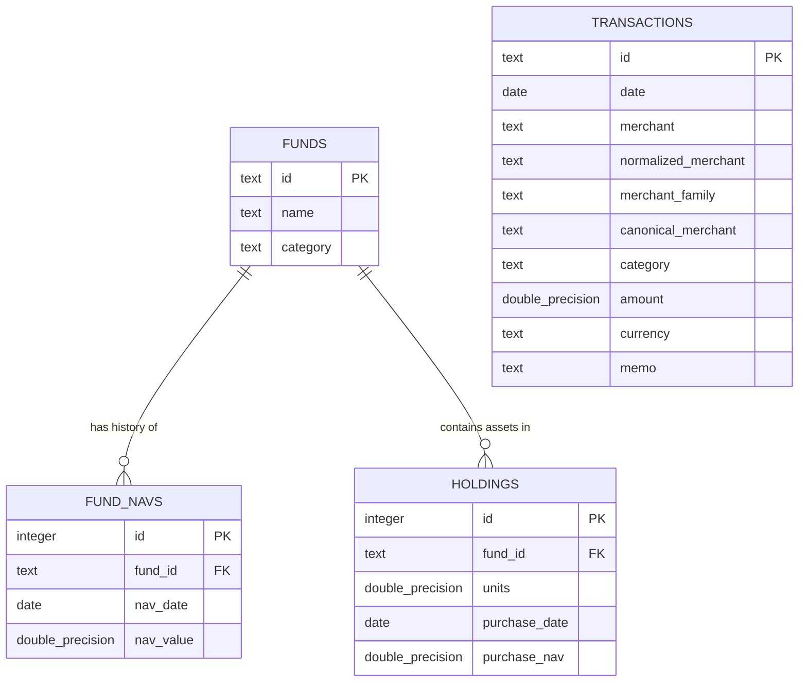

# Entity Relationship (ER) Diagram

```mermaid
erDiagram
    FUNDS {
        text id PK
        text name
        text category
    }

    FUND_NAVS {
        integer id PK
        text fund_id FK
        date nav_date
        double_precision nav_value
    }

    HOLDINGS {
        integer id PK
        text fund_id FK
        double_precision units
        date purchase_date
        double_precision purchase_nav
    }

    TRANSACTIONS {
        text id PK
        date date
        text merchant
        text normalized_merchant
        text merchant_family
        text canonical_merchant
        text category
        double_precision amount
        text currency
        text memo
    }

    FUNDS ||--o{ FUND_NAVS : "has history of"
    FUNDS ||--o{ HOLDINGS : "contains assets in"
```
